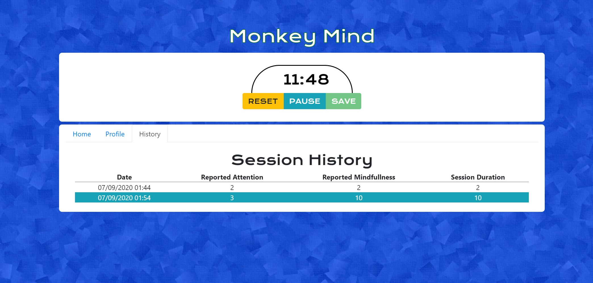

# Monkey Mind

Monkey Mind is a meditation timer which allows users to chart meditation progress through saved sessions add self-reported data like awareness and mindfulness.

## Demo
[View on Heroku](https://frozen-stream-42440.herokuapp.com/)

## Build
NPM I should be run on the server and client levels.
## Authors
[Brad Prichett](https://github.com/bradpritchett)

## Contributing
Pull requests are welcome. For major changes, please open an issue first to discuss what you would like to change.

Please make sure to update tests as appropriate.

## License
[ISC](https://choosealicense.com/licenses/ISC/)
